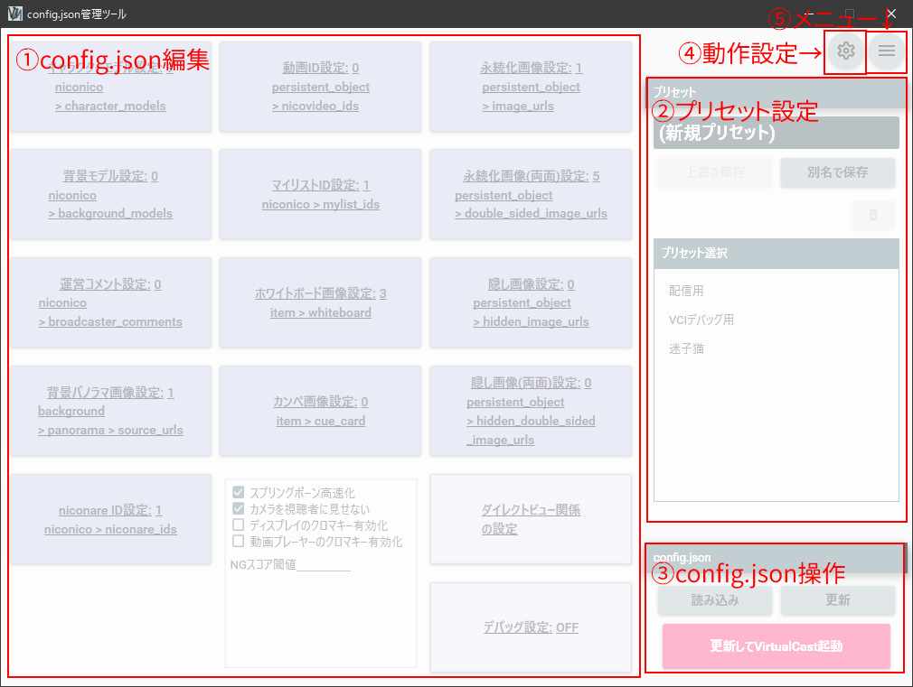

# VCasJSONManager操作マニュアル

## はじめに

このソフトウェアは、VirtualCastのconfig.jsonファイルを管理するツールです。  

**注意事項**  

VCasJsonManagerは、VirtualCastのconfig.jsonを直接書き換えることがあります。
すでにconfig.jsonを作成している場合は、VCasJsonManager起動前にバックアップを取っておくことをお勧めします。

***
***

## 操作方法

### メイン画面

  
メイン画面はこのような感じです。  
機能によって、以下のように分けられています。  

  

#### ①config.json編集

config.jsonを編集する場所です。各ボタンをクリックすることで、設定ダイアログが表示されます。
config.jsonについては、[VirtualCast Wiki](https://virtualcast.jp/wiki/doku.php?id=%E3%82%AB%E3%82%B9%E3%82%BF%E3%83%9E%E3%82%A4%E3%82%BA:config.json%E3%81%AE%E8%A8%AD%E5%AE%9A%E4%B8%80%E8%A6%A7)などを参照してください。  
config.jsonにてリストとなっている項目の設定ボタンには、現在設定されるアイテム数が表示されます。

#### ②プリセット設定

編集したconfig.jsonをプリセットして保存したり、保存済みのプリセットを呼び出す場所です。

#### ③config.json操作

VirtualCastのフォルダーにあるconfig.jsonファイルを操作する場所です。

#### ④動作設定

VCasJsonManagerの動作設定を行うダイアログを表示するボタンです。VCasJsonManagerの自動終了設定、ファイルパスの指定はここから行います。

#### ⑤メニュー

メニューを表示するボタンです。メニューからは、以下の操作が可能です。

- JSONファイルのインポート
- JSONファイルのエクスポート

***

### 動作設定

VCasJsonManagerの動作設定はこのダイアログで行います。

#### VirtualCast起動後にアプリケーション終了

チェックをONにすると、メイン画面の「更新してVirtualCast起動」ボタンでVirtualCastを起動した後、VCasJsonManagerを終了します。

#### VirtualCastの起動パス

VirtualCast.exeのパス、またはSteamで作成したVirtualCastのショートカットに設定されているURLを入力してください。

#### config.jsonのパス

config.jsonのパスを入力してください。

***

### プリセット設定について

プリセット設定の最上部に表示されているのは、現在読み込んでいるプリセットの名前です。  
編集したconfig.jsonの内容は、「上書き保存」ボタンか、「別名で保存」ボタンで保存できます。

#### 上書き保存

現在読み込んでいるプリセットの内容に上書きで保存します。

#### 別名で保存

新しい名前のプリセットを作成して保存します。

ゴミ箱マークのボタンは削除ボタンです。現在読み込んでいるプリセットを削除します。  
プリセット選択の部分に、保存されているプリセットのリストが表示されます。選択すると、選択したプリセットを読み込みます。

***

### config.jsonの操作について

VirtualCastのフォルダーにあるconfig.jsonを直接操作します。  
「読み込み」ボタンで、config.jsonの内容を読み込みます。「更新」ボタンで現在の編集内容でconfig.jsonを更新します。  
「更新してVirtualCast起動」ボタンをクリックすると、現在の編集内容でconfig.jsonを起動した後、VirtualCastを起動します。

config.jsonの操作は、動作設定にてVirtualCastのフォルダーが指定されていないと正しく動作しません。

***

### リスト項目の編集ダイアログ

config.json内でリストとなっている項目の編集は、以下のようなダイアログで行います。  
  
上部のテキストボックスに、IDやURLなどを入力して追加してください。  
モデルや動画などのIDを設定するリストについては、ニコニ立体やニコニコ動画の該当するページのURLを入力すると、ID部分を自動抽出します。  
また、画像URLを設定するリストでGoogleドライブの共有リンクのURLを入力すると、画像を直接表示するURLに自動変換します。

左下のゴミ箱アイコンは、リスト内の全項目を削除します。
各リスト項目の右側の三本線をドラッグすると、リスト項目を並べ替えることができます。

***

### JSONファイルのインポートとエクスポート

メニューから、JSONファイルのインポートやエクスポートができます。

#### インポート

他のconfig.json編集ツールで作成したJSONファイルなどをインポートできます。  
インポートしたJSONに、VCasJsonManagerで対応していないプロパティがある場合でも、そのプロパティはプリセットやconfig.jsonに
保存されます。

#### エクスポート

現在編集中の内容を、任意のJSONファイルにエクスポートします。

***
***
VCasJsonManager 1.3.4.9  
Copyright © 2019-2021 TOMA
